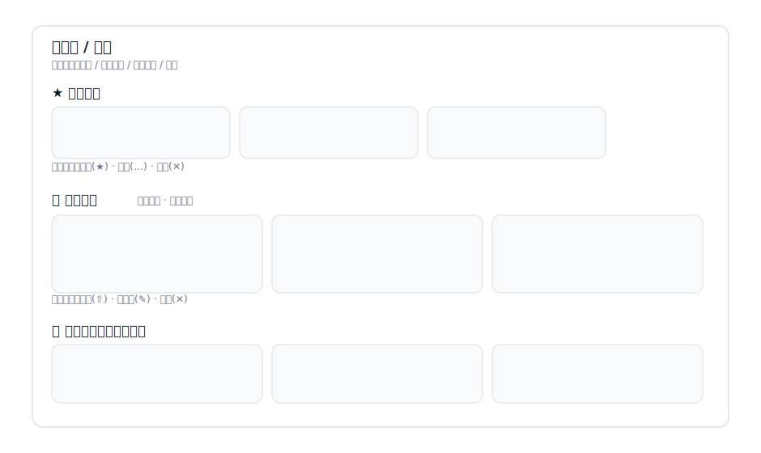

# 多人协作看板应用 🚀

一个现代化的多用户实时协作看板工具，专为团队项目管理而设计。支持项目/成员管理、邮件验证登录、实时协作、Trello 式卡组与卡片、稳定的内联编辑、拖拽排序、归档与导入导出、星标看板与“邀请管理”，并具备无闪烁的高质量交互体验。

## 目录（Contents）

- [最近改动要点（交互对齐）](#recent-changes)
- [🗺️ Roadmap（规划）](#roadmap)
- [🗂️ 项目与看板](#projects-boards)
- [导航与面包屑（Breadcrumbs）](#breadcrumbs)
- [置顶分组（Pin Group）](#pin-group)
- [星标与置前](#stars-move-front)
- [🧩 设计图（Architecture & Pages）](#design)
- [Mermaid（文本版图示）](#mermaid)
- [🧾 样式索引（Style Index）](#style-index)

## ✨ 主要特性

### 🎯 实时协作与编辑占用
- 多人同时编辑：同一看板实时广播更改
- 在线成员列表：显示在线用户
- 编辑占用提示：正在编辑的卡片会显示占用标记

### 👥 账号、邮件与成员/邀请
- 邮箱验证登录：注册后发送验证邮件（支持自定义 SMTP）；未验证邮箱不能登录
- 忘记/重置密码：邮件链接设置新密码（带 60s 频率限制）
- 邀请管理（首页导航）：
  - 我收到的邀请：接受/拒绝
  - 待我审批的加入申请（项目所有者）：同意/拒绝（打开弹窗后自动 3s 轮询）
  - 支持在弹窗内输入邀请码发起加入申请
- 成员管理（项目内）：查看成员、移除成员（仅所有者可移除他人，非所有者仅能移除自己）
- 严格所有权规则：
  - 仅项目所有者可删除项目
  - 仅项目所有者或看板创建者可删除/重命名看板
  - 被移出项目时客户端自动退出并返回首页

### 🗂️ 项目与看板
<a id="projects-boards"></a>
- 首页优先展示项目，提供“星标看板”与“快速访问看板”区
- 创建/重命名/删除 项目与看板（遵守所有权规则）
- 看板切换器（导航栏标题可点）：
  - 点击看板名显示下拉菜单
  - 支持搜索、创建看板（使用搜索框文本）、重命名当前/其他看板、快速切换
  - 下拉不展示已归档看板
- 项目切换器（项目页标题可点）：搜索/切换/创建项目
- 项目创建不再默认生成看板——良好处理“无看板”状态
- 看板归档：项目看板支持归档/还原；项目页底部可展开“归档的看板”并搜索
- 移动看板：支持在项目间移动（带项目选择器与搜索）
- 首页“项目置前”：支持将某项目卡片置前显示
 - 看板置前与更多操作：
   - 置前按钮（⇧）：仅在“项目看板列表”页显示，用于将该看板在本项目中置前排序。
   - “更多(…)”操作按钮：合并“重命名/移动/归档”为一个菜单；“删除(✕)”按钮保持独立，始终位于操作区最右侧。
   - 打开“更多(…)”菜单时，卡片的操作区不会消失，便于连续操作（焦点在菜单内时保持可见）。
- 归档看板区：三栏栅格，计数在首次渲染即正确；从归档区“还原”看板后保持展开状态与当前搜索，不会自动收起。

#### 导航与面包屑（Breadcrumbs）
<a id="breadcrumbs"></a>

- 结构：工作台 > 项目 > 看板。
  - 两侧用“面包屑箭头”展开对应的切换器，箭头初始朝右，展开时旋转为朝下（带过渡动画）。
- 看板页：
  - 工作台：点击返回“工作台”。
  - 项目：点击“项目箭头”展开“项目切换器”；点击“项目名”返回项目页（看板列表）。
  - 看板：点击“看板箭头”展开“看板切换器”；点击“看板名”进行内联重命名（仅当用户为项目所有者或该看板创建者）。
- 项目页：
  - 工作台：点击返回“工作台”。
  - 项目：点击“项目箭头”展开“项目切换器”；点击“项目名”进行内联重命名（仅项目所有者）。
- 交互细节：
  - 内联重命名：Enter 保存、Esc 取消、失焦保存；保存后立即更新标题与本地状态；仅在有权限时启用。
  - 仅“箭头”展开面包屑；名称点击用于“返回”或“内联重命名”（按页面与权限而定）。

示意图：


#### 置顶分组（Pin Group）
<a id="pin-group"></a>

- 功能已上线：
  - 首页与项目页的卡片列表按“置顶分组 / 普通分组”展示；两组间有“置顶 / 全部”的分隔标题。
  - 置顶/取消置顶：鼠标移到标题左侧图标，图标切换为 pin/pin-off，点击即可切换；置顶项 pin 常亮。
  - 组内排序：保留“移到最前/移到最后”，仅在当前分组内调整顺序。
  - 新建：新建项目/看板默认进入“普通分组”，位于“置顶分组”之后。
  - 图标策略：
    - 项目页看板卡片：使用内联 SVG（Icon.boards）作为未置顶基础图标；置顶显示 pin。
    - 首页看板卡片：不再显示卡片左侧图标（保持布局干净）。
    - “所有看板”标题仍显示 boards 图标。


#### 看板卡片操作区示意


## 🧩 设计图（Architecture & Pages）
<a id="design"></a>

### 架构图


### 页面线框图（Wireframes）

- 登录页（邮箱验证登录、忘记/重置密码）

  

- 工作台 / 首页（星标看板、项目管理、所有看板）

  

- 项目看板页（看板列表、归档看板区展开/搜索）

  

- 看板页（列表/卡片、内联编辑、导入/导出、归档管理）

  

- 归档页（归档任务搜索、清空归档）

  

- 管理员页（用户列表、属性修改、删除用户限制）


### 时序图（Sequence Diagrams）

- 看板重命名/移动/删除 端到端流程（REST + 文件存储 + WS 广播）

  

- 邀请码加入项目与审批流程


### Mermaid（文本版图示）
<a id="mermaid"></a>

> 若你的渲染环境支持 Mermaid，可直接查看下列文本版图示；否则请参考上面的 SVG 图片版本。

#### 架构图（Mermaid）

```mermaid
flowchart LR
  client[Browser SPA\n(public/)]

  subgraph Server[Node.js + Express + ws\n(server.js)]
    api[REST APIs]
    hub[WebSocket Hub]
    mail[(SMTP Mailer)]
  end

  subgraph Storage[File Storage (data/)]
    users[(users.json)]
    projects[(projects.json)]
    boards[({projectId}_{board}.json)]
    backups[(backups/)]
  end

  client -- Fetch --> api
  client <--> hub
  api --> users
  api --> projects
  api --> boards
  api --> backups
  api --> mail
```

#### 看板重命名/移动/删除（Mermaid 时序）

```mermaid
sequenceDiagram
  autonumber
  participant C as Client (SPA)
  participant S as Server (Express)
  participant D as Data Files (data/)

  rect rgb(245,245,245)
    Note over C,S: Rename Board
    C->>S: POST /api/rename-board
    S->>D: Rename {pid}_{old}.json → {pid}_{new}.json
    S->>D: Update projects.json (boards, boardOwners)
    S->>D: Update users.json stars/pins (boardName)
    S-->>C: 200 OK
    S-->>C: WS board-renamed
  end

  rect rgb(245,245,245)
    Note over C,S: Move Board
    C->>S: POST /api/move-board
    S->>D: Move file to {toPid}_{board}.json
    S->>D: Update projects.json (from→to)
    S->>D: Update users.json stars projectId; clear pinnedBoards[from]
    S-->>C: 200 OK
    S-->>C: WS board-moved
  end

  rect rgb(245,245,245)
    Note over C,S: Delete Board
    C->>S: DELETE /api/delete-board
    S->>D: Remove {pid}_{board}.json
    S->>D: Clean users.json stars/pins for this board
    S-->>C: 200 OK
  end
```

#### 邀请码加入与审批（Mermaid 时序）

```mermaid
sequenceDiagram
  autonumber
  participant U as Applicant (Client)
  participant S as Server (Express)
  participant P as Project Data (projects.json)

  U->>S: POST /api/join-project (inviteCode)
  S->>P: pendingRequests += user
  S-->>U: 200 OK (submitted)
  S-->>U: WS join-request (to project participants)

  participant O as Owner (Client)
  O->>S: POST /api/approve-join (or equivalent)
  S->>P: members += user; remove pendingRequests
  S-->>O: 200 OK
  S-->>U: WS member-added
```

#### 页面导航 / 状态流（Mermaid）


#### 模块依赖图（Mermaid）

```mermaid
flowchart TB
  subgraph Client
    App[SPA app.js]
  end
  subgraph Server[Express + ws]
    Auth[/Auth/]
    Projects[/Projects/]
    Boards[/Boards/]
    Stars[/Stars/]
    Pins[/Pins/]
    Admin[/Admin/]
    IO[/Import/Export/]
    Hub[WebSocket Hub]
  end
  subgraph Storage[data/]
    U[(users.json)]
    P[(projects.json)]
    F[({pid}_{board}.json)]
    BK[(backups/)]
  end

  App --> Auth
  App --> Projects
  App --> Boards
  App --> Stars
  App --> Pins
  App --> Admin
  App --> IO
  App <--> Hub

  Auth --> U
  Projects --> P
  Boards --> P
  Boards --> F
  IO --> F
  Stars --> U
  Pins --> U
  Admin --> U
  Boards -.备份.-> BK
```

#### 数据模型（Mermaid 类图）


## 🔐 权限矩阵（简化）

| 动作 | 项目所有者 | 看板创建者 | 项目成员 |
|---|---|---|---|
| 创建看板 | ✅ | ✅ | ✅ |
| 重命名看板 | ✅ | ✅ | ❌ |
| 移动看板到其他项目 | ✅ | ✅（且目标项目成员） | ❌ |
| 归档/还原看板 | ✅ | ✅ | ❌ |
| 删除看板 | ✅ | ✅ | ❌ |
| 重命名项目 | ✅ | ❌ | ❌ |
| 删除项目 | ✅ | ❌ | ❌ |
| 添加/移除成员 | ✅（移除他人） | ❌ | 自行退出 |
| 审批加入申请 | ✅ | ❌ | ❌ |
| 星标/取消星标 | ✅ | ✅ | ✅ |
| 置前项目 | ✅ | ✅ | ✅（项目成员即可） |
| 置前看板（项目页） | ✅ | ✅ | ✅（项目成员即可） |
| 星标区置前 | ✅ | ✅ | ✅ |

> 注：服务端已在相关 API 中进行权限校验；前端将“更多(…)”与“删除(✕)”按权限显示/隐藏。

## 🎨 UI 主题与交互规范（摘录）

- 颜色与语义
  - 文字：#111827 / 次要 #374151 / 辅助 #6b7280
  - 主色：#3b82f6（按钮/高亮），危险：#dc2626（删除）
  - 边框：#e5e7eb，卡片 hover 边：var(--primary-light)
- 尺寸与间距
  - 卡片圆角：10–12px；按钮圆角：6–8px
  - 列间距：12px；卡片间距：12px；看板三栏布局
  - 常用按钮大小：32×32（操作区小按钮）
- 字体
  - 系统字体栈（system-ui, -apple-system, Segoe UI, Roboto, Helvetica, Arial）
  - 标题 16–18px，正文 13–14px
- 交互状态
  - Hover：轻色背景/边框增强；Focus-visible：清晰的描边与阴影
  - 操作区显示：悬停显示；打开“更多(…)”菜单时为卡片加 hold-actions，保持显示
  - 删除(✕)：始终置于操作区最右；更多(…) 合并重命名/移动/归档
- 栅格与响应式
  - 首页卡片与项目页卡片：三栏（宽屏），两栏（中屏）；归档看板列表固定三栏
  - 归档页任务：单列，与普通卡片样式一致

## 🧾 样式索引（Style Index）
<a id="style-index"></a>

主要样式文件：`public/style.css`

- 结构说明：文件顶部含“CSS Structure Index”，可按“SECTION:” 标签快速定位：
  - SECTION: Variables & Resets
  - SECTION: Layout & Containers
  - SECTION: Headers & Breadcrumbs（含看板/项目页面包屑、链接样式与字号对齐）
  - SECTION: Pages（Project / Board Select / Board / Archive 的头部与页面特定规则）
  - SECTION: Components（看板卡片、列表、项目/看板卡片、按钮等）
  - SECTION: Actions Menus / Switchers（下拉菜单、更多菜单、切换器）
  - SECTION: Grids（归档看板三栏、项目页工具两列）
  - SECTION: Buttons & Utilities（按钮态、通用工具类）
  - SECTION: Dark Mode Overrides（深色模式覆盖）
  - SECTION: Responsive（断点适配）

维护建议：优先修改组件层，再通过页面段落做轻量覆盖；避免重复声明字号/间距。


### 🧱 Trello 式卡组（List）
- 动态卡组（客户端 lists 元数据）：新增/重命名/删除，顺序持久化
- 卡组拖拽排序：列表头/标题为手柄；释放后保存顺序（容器单一 ondragover）
- 设计规范（见 `public/style.css`）：列宽 272px、间距 12px、列背景 #ebecf0，样式作用域 `#boardPage`

### 📝 卡片（Card）与内联编辑
- 标题/描述内联编辑：多行、绝对定位锁高，避免抖动；Esc 取消；Ctrl/Cmd+Enter 保存
- 负责人与截止日期：浮层选择与固定尺寸的日期输入，不改变布局
- 评论/帖子（Posts）：详情抽屉内嵌评论列表与输入框；卡片正面显示评论数徽标；抽屉打开时收到更新自动刷新
- 归档：卡片可归档/还原；归档页支持删除；看板支持归档/还原（项目页下方）
- 快速添加：
  - 列底部“添加卡片” composer（Enter 提交，Esc 取消）
  - 列空白处按 Enter 快速展开 composer
  - 提交后 composer 保持打开，便于连续添加

### ↔️ 拖拽与排序
- 列内拖拽排序：拖拽卡片改变同列顺序并持久化
- 跨列移动：拖拽到其他列自动发送移动消息并更新
- 卡组拖拽：释放后保存 lists 顺序（容器单一 ondragover）

### ⬆️ 导入/导出与备份

#### 支持的格式

| 格式 | 扩展名 | 特点 | 用途 |
|------|--------|------|------|
| **TaskPaper** | `.taskpaper` | 简洁、纯文本友好 | 快速编辑、版本控制、与其他工具集成 |
| **Markdown** | `.md` | 详细、包含元数据 | 文档归档、完整备份 |
| **JSON** | `.json` | 原始数据 | 程序处理、完整迁移 |

#### TaskPaper 格式示例

```
待办:

- 完成用户认证模块 @张三 @due(2024-03-15)
- 修复登录 bug
- 编写单元测试 @李四

进行中:

- 代码审查 @王五 @due(2024-03-10)

已完成:

- 数据库设计
```

**TaskPaper 语法**：
- `列名:` — 以冒号结尾定义列
- `- 内容` — 以 `- ` 开头定义卡片
- `@用户名` — 指定负责人
- `@due(日期)` — 指定截止日期

#### 导入导出操作

- **I/O 菜单**：导航栏"导入/导出"下拉
  - 从文件导入（`.json` / `.md` / `.taskpaper`）
  - 从文本导入（自动检测格式）
  - 导出为 TaskPaper（简洁）
  - 导出为 Markdown（详细）
  - 导出为 JSON
- **导入模式**：支持"合并"或"覆盖"两种模式
- **文本导入**：Enter 换行，Ctrl+Enter 确认
- **自动备份**：每次写入在 `data/backups/` 生成时间戳版本，保留最近 50 份

### ⭐ 星标看板（服务器持久化）
- 星标列表为每个用户服务器持久化（非本地存储）
- 首页与项目页看板卡片提供星标按钮；顶部“星标看板”区按最近加星时间倒序展示
- 重命名/移动/删除看板后会同步更新星标记录；跨项目移动后星标仍保留
 - 独立的星标置前顺序：星标区支持单独的“置前(⇧)”按钮与排序，不影响项目内的看板排序。

### 🧭 历史与状态（无闪烁）
- 前进/后退可在“首页/项目页/看板/归档页”之间切换
- 本地记忆：用户/页面/项目/看板状态（localStorage），刷新后恢复
- 无闪烁渲染：离线构建 + 占位显示、滚动位置恢复、首条 WS 更新抑制、编辑中延迟重渲染
- 成员资格守护：被移出项目时 2s 内自动退出并提示

### ⌨️ 键盘快捷键
- Enter：
  - 列空白处：打开“添加卡片”
  - composer 中：Enter 提交，Shift+Enter 换行
  - 动态对话框：Enter 确认
- Esc：关闭最顶层动态弹窗/抽屉/对话框/导入弹窗/成员与邀请弹窗/创建与加入项目层
- Ctrl/Cmd+Enter：保存标题/描述等内联编辑与抽屉描述

## 🧭 使用指南

### 账号与项目
1. 注册后前往邮箱验证，再登录
2. 首页创建项目，或在“邀请管理”中输入邀请码发起加入申请
3. 进入项目选择看板，或在导航栏点击看板名打开切换器进行切换/创建/重命名（下拉不展示已归档看板）

### 🎬 录屏生成 GIF（建议放在 PR 或发布说明中）

- macOS（推荐）：
  - 录屏：按 Command+Shift+5 选择“录制所选区域”，保存为 `.mov`。
  - 转 GIF（需要 ffmpeg 与 gifski）：
    ```bash
    # 使用 Homebrew 安装
    brew install ffmpeg gifski
    # 先缩放并导出高质量 GIF（12fps，可以根据需要调整）
    ffmpeg -i screen.mov -vf "fps=12,scale=960:-1:flags=lanczos" -f gif - | gifski -o demo.gif --fps 12 --quality 80 -
    ```

- Windows：
  - 录屏：可使用 PowerToys 的屏幕录像或 OBS 录制为 `.mp4`。
  - 转 GIF（使用调色板提高清晰度）：
    ```bash
    ffmpeg -y -i screen.mp4 -vf "fps=12,scale=960:-1:flags=lanczos,palettegen" palette.png
    ffmpeg -i screen.mp4 -i palette.png -lavfi "fps=12,scale=960:-1:flags=lanczos,paletteuse" demo.gif
    ```

- Linux：
  - 录屏：可用 Peek（GUI）或 ffmpeg 直接录制 X11/Wayland。
  - 例：用 ffmpeg 录制并转 GIF：
    ```bash
    # 录制屏幕区域到 mp4（自行调整 -video_size 与 -offset）
    ffmpeg -f x11grab -video_size 1280x720 -framerate 30 -i :0.0+100,200 -c:v libx264 -preset ultrafast screen.mp4
    # 生成高质量 GIF
    ffmpeg -y -i screen.mp4 -vf "fps=12,scale=960:-1:flags=lanczos,palettegen" palette.png
    ffmpeg -i screen.mp4 -i palette.png -lavfi "fps=12,scale=960:-1:flags=lanczos,paletteuse" demo.gif
    ```

小贴士：
- 建议控制分辨率（如宽度 960px）与帧率（如 10–12fps），在清晰度与体积间取得平衡。
- 可用 `gifsicle -O3 demo.gif -o demo.min.gif` 进一步压缩体积。

### 看板与卡片
- 每个卡组底部提供“添加卡片”入口（点击展开、Enter 添加、Esc 取消），在列表空白处按 Enter 也可展开；提交后保持打开便于连续添加
- 卡片正面：标签点、标题、徽标行（描述/评论/截止日期/负责人）
- 点击卡片打开详情抽屉，或点击标题/描述进入内联编辑
- 归档页支持搜索过滤（标题/描述/标签/负责人）

## 🔌 API 参考（摘要）

### 认证与邮箱
- POST `/api/register` { username, password, email }
- POST `/api/login` { username, password }（支持邮箱登录）
- GET `/api/verify?token=...` 邮箱验证回调
- POST `/api/resend-verification` { username }（60s 频率限制）
- POST `/api/forgot-password` { email? | username? }（60s 频率限制）
- POST `/api/reset-password` { token, newPassword }
- POST `/api/change-password` { username, oldPassword, newPassword }

### 项目与看板
- GET `/api/user-projects/:username`
- POST `/api/create-project` { username, projectName }
- POST `/api/rename-project` { projectId, newName }
- DELETE `/api/delete-project` { projectId, actor }
- GET `/api/project-boards/:projectId` → { inviteCode, members, boards, owner, boardOwners, archivedBoards }
- POST `/api/create-board` { projectId, boardName, actor }
- POST `/api/rename-board` { projectId, oldName, newName, actor }
- POST `/api/archive-board` { projectId, boardName, actor }
- POST `/api/unarchive-board` { projectId, boardName, actor }
- POST `/api/move-board` { fromProjectId, toProjectId, boardName, actor }
- DELETE `/api/delete-board` { projectId, boardName, actor }
- GET `/api/board/:projectId/:boardName`
- GET `/api/export/:projectId/:boardName` → Markdown 下载（详细格式）
- GET `/api/export-taskpaper/:projectId/:boardName` → TaskPaper 下载（简洁格式）
- GET `/api/export-json/:projectId/:boardName` → JSON 下载

### 成员与邀请
- GET `/api/user-invites/:username`
- POST `/api/accept-invite` { username, projectId }
- POST `/api/decline-invite` { username, projectId }
- GET `/api/user-approvals/:username`
- GET `/api/join-requests/:projectId`
- POST `/api/join-project` { username, inviteCode }
- POST `/api/approve-join` { projectId, username, actor }
- POST `/api/deny-join` { projectId, username, actor }
- POST `/api/remove-project-member` { projectId, username, actor }
- POST `/api/regenerate-invite-code` { projectId, actor }
- POST `/api/request-add-member` { projectId, username, actor } （项目内发起添加请求）

### 背景管理（每用户）
- GET `/api/default-backgrounds` → `{ defaults: string[] }`（返回至多 3 个默认背景 URL）
- GET `/api/user-background/:username` → `{ url: string }`（未设置时为空串）
- POST `/api/user-background/set-default` `{ username, index }` → `{ url }`
- POST `/api/user-background/upload` `{ username, imageData }` → `{ url }`
  - `imageData` 为 DataURL（PNG/JPEG/WEBP，≤10MB），成功返回形如 `/uploads/wallpapers/<username>.<ext>` 的 URL
- POST `/api/user-background/clear` `{ username }` → `{ success: true }`

注意：上传/清除会删除该用户名下不同扩展的旧文件（png/jpg/jpeg/webp）。前端对同源 URL 自动追加时间戳，避免浏览器缓存导致的刷新才能生效问题。

<a id="stars-move-front"></a>
### 星标与置前
- GET `/api/user-stars/:username` → { stars }
- POST `/api/user-stars/toggle` { username, projectId, boardName, projectName } → { stars, starred }
- POST `/api/user-pins/pin` { username, projectId }（项目置前：仅将该用户的项目顺序移动至最前，不设置置顶分组）
- POST `/api/user-board-pins/pin` { username, projectId, boardName }（看板置前：将该看板移动到项目看板顺序最前，作为一次性排序）
 - GET `/api/user-star-pins/:username` → { pins }（星标列表的置前顺序，仅影响星标区）
 - POST `/api/user-star-pins/pin` { username, projectId, boardName } → { pins }（置前指定星标看板至星标区最前）

### 管理员
- POST `/api/admin/login` { username, password }
- POST `/api/admin/logout` Bearer token
- GET `/api/admin/users` Bearer token
- PATCH `/api/admin/users/:username` { verified?, admin?, password? } Bearer token
- DELETE `/api/admin/users/:username` Bearer token（若用户是任一项目所有者将被阻止）

> 注：客户端通过 WebSocket 同步看板变更；归档看板不会出现在首页/项目看板列表中（可在项目页底部展开“归档的看板”并搜索、还原或删除）。

## 🌐 WebSocket 消息（关键类型）
- `join` 加入看板
- `board-update` 看板数据更新（含 lists 元信息与各列卡片）
- `user-list` 在线用户更新
- `card-editing` 某卡片被用户编辑/释放
- `add-card` / `update-card` / `delete-card`
- `move-card` / `reorder-cards`
- `archive-card` / `restore-card` / `clear-archive`
- `save-lists` 保存卡组元信息（新增/重命名/删除/排序）
- `import-board` 导入数据（merge/overwrite）
- `project-renamed` / `board-renamed` / `board-moved` / `project-deleted` / `member-removed` / `member-added` / `join-request` / `import-success` / `error`

## 🗃️ 数据模型（要点）

### projects.json（示意）
```json
{
  "pid123": {
    "name": "项目A",
    "inviteCode": "ABC123",
    "owner": "alice",
    "created": "2024-01-01T00:00:00.000Z",
    "members": ["alice", "bob"],
    "boards": ["默认看板", "迭代一"],
    "boardOwners": { "默认看板": "alice" },
    "pendingRequests": []
  }
}
```

### {projectId}_{board}.json（示意）
```json
{
  "todo": [],
  "doing": [],
  "done": [],
  "archived": [],
  "lists": {
    "listIds": [],
    "lists": {}
  }
}
```

说明：新建看板默认不再生成固定列（空 `lists`）。读取旧版/导入数据时若存在 `todo/doing/done` 等固定数组，会自动推断为对应列表元信息；否则保持为空，由用户自行添加卡组。

### 卡片（可能包含的可选字段）
- labels: string[]
- checklist?: { items?: {text:string,done:boolean}[], done:number, total:number }
- commentsCount?: number
- attachmentsCount?: number
- priority?: "low"|"med"|"high"
- posts?: { id:string, author:string, text:string, created:string, edited?:string }[]

## ⏱️ 频率限制
- 重新发送验证邮件：同一用户 60s 一次
- 忘记密码邮件：同一用户 60s 一次

## 💾 备份策略
- 每次数据写入都会在 `data/backups/` 生成时间戳备份文件
- 文件名：`{projectId}_{boardName}_{ISO时间}.json`
- 定时清理：仅保留最近 50 份

## 📁 项目结构

```
kanban/
├── public/                 # 前端资源（Vanilla JS）
│   ├── index.html          # 单页应用
│   ├── app.js              # 前端逻辑（WS、内联编辑、拖拽、邀请/成员/星标/切换器等）
│   ├── style.css           # Trello 风格与布局、内联编辑稳定样式
│   ├── admin.html, admin.js# 管理员页面（独立）
│   └── ...
├── server.js               # Node.js + Express + ws 服务端（含 SMTP 邮件）
├── data/                   # 文件型 JSON 存储与备份
│   ├── users.json
│   ├── projects.json
│   ├── {projectId}_{board}.json
│   └── backups/
│   └── uploads/
│       └── wallpapers/        # 用户上传的背景图（<username>.<ext>）
├── web/                    # 前端重构（React + TypeScript + Vite，进行中）
├── Dockerfile              # 容器镜像（生产）
├── docker-compose.dev.yml  # 本地开发（OrbStack/volume）
├── docker-compose.prod.yml # 服务器部署（持久化数据卷）
├── docker-compose.prod.build.yml # 服务器上构建镜像
├── postcss.config.cjs      # CSS 构建管线
├── package.json
└── README.md
```

## 🔧 技术栈
- 前端：原生 JavaScript + HTML + CSS（`web/` 为进行中的 React + TypeScript + Vite 重构）
- 样式构建：PostCSS（import/autoprefixer/cssnano/purgecss）
- 后端：Node.js + Express
- 实时：WebSocket（ws）
- 存储：文件型 JSON（可直接查看/备份/版本化）
- 邮件：nodemailer（自定义 SMTP 或 Ethereal 预览）
- 配置：dotenv

## 🛠️ 快速开始

### 1) 安装依赖
```bash
npm install
```

### 2) 配置环境变量
复制 `.env.example` 为 `.env` 并按需修改：
```env
PORT=3000
NODE_ENV=development
BASE_URL=http://localhost:3000

# SMTP（用于邮件验证与重置密码）
SMTP_HOST=
SMTP_PORT=587
SMTP_SECURE=false
SMTP_USER=
SMTP_PASS=
MAIL_FROM=
# 开发可使用 Ethereal 预览邮箱（非生产投递）
USE_ETHEREAL=true

# 管理员启动引导（首次运行自动创建/提升）
ADMIN_USERNAME=admin
ADMIN_PASSWORD=admin123
ADMIN_EMAIL=
```

### 3) 启动服务
```bash
npm start
# 或临时指定端口
PORT=3001 node server.js
```
访问 `http://localhost:3000`

### 背景相关环境变量（可选）
支持为“默认背景”提供 1–3 个候选项，并作为用户级持久背景使用：

```env
# 单个默认背景（回退值）
DEFAULT_BG_URL=https://example.com/bg.webp

# 提供多个默认背景（最多取前三个，优先级高于下方 _1/_2/_3）
DEFAULT_BG_URLS=https://a.jpg, https://b.webp, https://c.png

# 或者按序提供（当未设置 DEFAULT_BG_URLS 时生效）
DEFAULT_BG_URL_1=
DEFAULT_BG_URL_2=
DEFAULT_BG_URL_3=
```

说明：
- 前端“背景 ▾”菜单提供“默认背景 / 上传背景 / 清除背景”。
- 背景为“每用户”设置，服务端持久化于 `users.json` 的 `backgroundUrl` 字段；不再使用本地存储。
- 同源上传后即时生效（自动追加时间戳防缓存），支持 PNG/JPEG/WEBP，最大 10MB。
- 服务器保存路径：`data/uploads/wallpapers/<username>.<ext>`；上传/清除时会清理该用户名下其它扩展，避免“同名不同扩展”冲突。

## 🐳 使用 Docker（可选）
- 开发（本机调试、挂载代码卷）
```bash
docker compose -f docker-compose.dev.yml up -d
```
  - 端口映射：`3000:3000`
  - 挂载：`./data:/app/data`（持久数据）、`./public:/app/public`（静态资源热调试）、`./server.js:/app/server.js`（需手动重启）、`./index.html`、`./kanban.js`、`./markdown.js`
- 生产（服务器部署）
  - 在服务器上构建镜像：
```bash
docker compose -f docker-compose.prod.build.yml build
```
  - 以持久化数据卷运行：
```bash
docker compose -f docker-compose.prod.yml up -d
```
  - 端口映射：`3000:3000`；命名卷：`kanban_data:/app/data`

## 🔐 管理员控制台
- 访问路径：`/admin`
- 登录：使用管理员账号密码（首次运行可通过 `.env` 中 `ADMIN_*` 引导创建/提升）
- 功能：
  - 列出用户（邮箱/是否验证/是否管理员/项目数/创建时间）
  - 切换邮箱验证状态、切换管理员、重置密码
  - 删除用户（如用户是任一项目所有者将被阻止）

## 📐 项目规范（Project Standards）

### 运行与端口
- 本地启动：`npm start`（自动加载 `.env`）
- 也可：`node server.js` 或 `PORT=xxxx node server.js`

### Git 流程
- 提交信息：简明清晰，说明动机与影响（示例：`fix/ui: 稳定内联编辑宽度，去除右侧间距`）
- 请勿提交本地个性化设置文件（如 `.env`）
- 分支命名：功能 `feature/<name>`，修复 `fix/<name>`

### 前端样式与交互
- 保持 4 空格缩进
- Trello 风格：
  - 设计令牌定义在根/作用域下，覆盖集中到样式末尾
  - 列宽 272px、间距 12px、背景 #ebecf0
  - 看板页面样式作用域为 `#boardPage`
- 内联编辑稳定性：
  - 标题/描述编辑器绝对定位覆盖原文本，容器 `position: relative` 锁高
  - 日期/负责人编辑采用浮层或固定宽高输入，避免布局抖动
- 列与卡片拖拽：避免重复绑定；容器使用单一 `ondragover` 处理

## 🤝 贡献
- 欢迎提交 Issue 与 PR 改进项目
- 如需更详细规范，建议新增 `CONTRIBUTING.md`

## 📄 许可
MIT
<a id="recent-changes"></a>
### 最近改动要点（交互对齐）

- 命名：主页统一称为“工作台”。
- 面包屑职责统一：
  - 仅“箭头 ▸/▾”用于展开对应的切换器；
  - 名称用于“返回”（项目名返回项目页、工作台返回首页）或“内联重命名”（看板名/项目名，需权限）。
- 内联重命名：
  - 看板名：仅项目所有者或看板创建者；Enter 保存、Esc 取消、失焦保存；刷新后也可立即编辑；不会误触发新增卡片输入。
  - 项目名：仅项目所有者；同上交互规则。
- 置顶分组：
  - 新增“置顶 / 普通”分组；置顶项 pin 常亮，组内“移到最前/移到最后”。
  - 标题左侧图标悬停切换为 pin/pin-off，点击置顶/取消置顶。
  - 新建进入“普通分组”（置顶分组之后）。
- 首页“所有看板”支持搜索：按看板名/项目名实时过滤。
- 图标策略：
  - 项目页看板卡片使用内联 SVG（Icon.boards）作为基础图标（未置顶），置顶显示 pin；
  - 首页看板卡片不显示左侧图标；
  - “所有看板”标题仍显示 boards 图标。
- 导航对齐：看板页导航与项目页在桌面断点（≥1024px）使用相同容器宽度（1200）与左右间距（2rem），底部边框与间距一致；箭头 hover 位移、展开旋转动画一致。

新增（本次）：
- 新建看板不再自动生成默认列；空看板时“+ 添加卡组”按钮水平居中，空状态下半透明，但尺寸与常规一致。
- “添加卡组”输入：单次 Esc 即可关闭；点击外部/失焦关闭；不改变输入框布局；连续添加体验保持。
- 归档页：卡片更紧凑、左对齐网格布局；“还原”按钮移动到标题行左侧；搜索计数与展开状态保持一致。
- 背景管理：背景下拉改为“默认/上传/清除”，由服务端持久化（每用户）；支持通过环境变量提供 1–3 个默认背景；上传非 PNG 的壁纸无需刷新立即生效；清除/上传会清理旧扩展避免冲突。
<a id="roadmap"></a>
## 🗺️ Roadmap（规划）

- 置顶（Pin Group）：已实现（见上文）。
